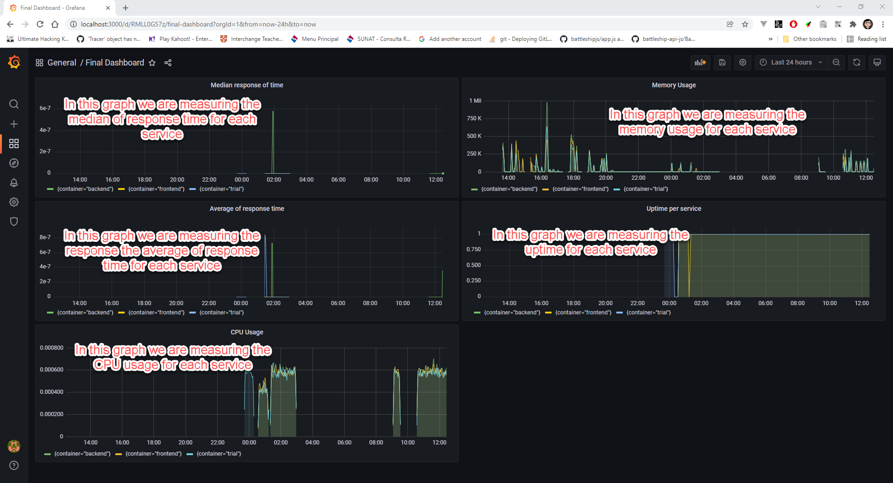

**Note:** For the screenshots, you can store all of your answer images in the `answer-img` directory.

## Verify the monitoring installation

*TODO:* run `kubectl` command to show the running pods and services for all components. Take a screenshot of the output and include it here to verify the installation

**Get all pods and services:**

```sh
kubectl get po,svc -A
```

**Answer image:**


## Setup the Jaeger and Prometheus source
*TODO:* Expose Grafana to the internet and then setup Prometheus and Jaeger as a data source. Provide a screenshot of the home page after logging into Grafana.

**Exposing Grafana to 3000:**

```sh
kubectl port-forward -n monitoring svc/prometheus-grafana --address 0.0.0.0 3000:80
```

**Answer image:**


## Create a Basic Dashboard
*TODO:* Create a dashboard in Grafana that shows Prometheus as a source. Take a screenshot and include it here.

**Exposing Grafana to 3000:**

```sh
kubectl port-forward -n monitoring svc/prometheus-grafana --address 0.0.0.0 3000:80
kubectl port-forward -n observability svc/simplest-query --address 0.0.0.0 3030:16686
```

**Answer image:**


## Describe SLO/SLI
*TODO:* Describe, in your own words, what the SLIs are, based on an SLO of *monthly uptime* and *request response time*.

If a Service-Level Objective (SLO) is a measurable goal like `The average time taken to return a request will be less than 200 ms, during the month of May`, a Service-Level
Indicator (SLI) is a measurement like `The average time taken to return a request during the month of May was 194 ms`.

## Creating SLI metrics.
*TODO:* It is important to know why we want to measure certain metrics for our customer. Describe in detail 5 metrics to measure these SLIs. 

- `Server/Service uptime` to know if the customer can access to the app anytime.
- `Latency` to know the amount of time the customer needs to wait until get a response.
- `Resource consumption` to know what services consume a lot of resources and makes the app slower for the consumer.
- `Error rate` to know what services are less robust and makes unhappy to customer.
- `Amount of requests` to know what services needs to be improve to have a better performance to handle the requests from the customer.


## Create a Dashboard to measure our SLIs
*TODO:* Create a dashboard to measure the uptime of the frontend and backend services We will also want to measure to measure 40x and 50x errors. Create a dashboard that show these values over a 24 hour period and take a screenshot.

**Answer image:**


## Tracing our Flask App
*TODO:*  We will create a Jaeger span to measure the processes on the backend. Once you fill in the span, provide a screenshot of it here.

**Answer image:**


## Jaeger in Dashboards
*TODO:* Now that the trace is running, let's add the metric to our current Grafana dashboard. Once this is completed, provide a screenshot of it here.

**Answer image:**


## Report Error
*TODO:* Using the template below, write a trouble ticket for the developers, to explain the errors that you are seeing (400, 500, latency) and to let them know the file that is causing the issue.

TROUBLE TICKET

Name: add_star endpoint doesn't work properly returning a 500 http status code
Date: 2021/09/11
Subject: MongoDB unreachable
Affected Area: add_star (POST /star) endpoint in backend app
Severity: ERROR
Description: Backend app cannot connect to MongoDB

**Answer image:**


## Creating SLIs and SLOs
*TODO:* We want to create an SLO guaranteeing that our application has a 99.95% uptime per month. Name three SLIs that you would use to measure the success of this SLO.

- uptime
- http request rate
- http request time
- error rate
- cpu/memory usage

## Building KPIs for our plan
*TODO*: Now that we have our SLIs and SLOs, create KPIs to accurately measure these metrics. We will make a dashboard for this, but first write them down here.

**Uptime**

I chose these metrics because I want to know what services are available for customers

- backend service uptime
- frontend service uptime
- trial service uptime

**Latency**

I chose these metrics because I want to know what's the time the customer needs to way to get a response

- average of response time 
- median response time

**Resource usage**

I chose these metrics because I want to know what's the resource consumption of each service

- Memory usage
- CPU usage

## Final Dashboard
*TODO*: Create a Dashboard containing graphs that capture all the metrics of your KPIs and adequately representing your SLIs and SLOs. Include a screenshot of the dashboard here, and write a text description of what graphs are represented in the dashboard.  

**Answer image:**

